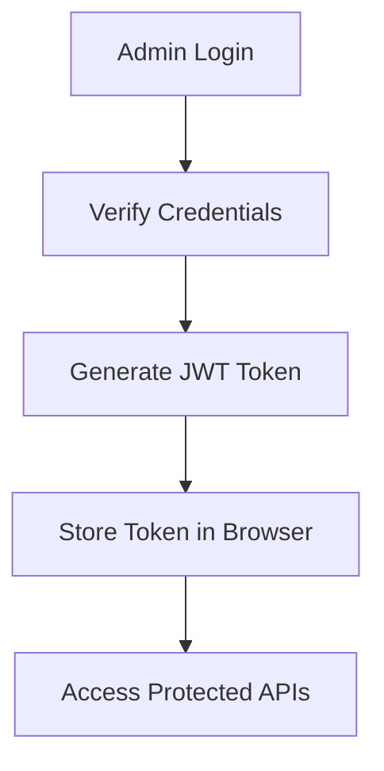

# 🏥 MediConnect – Real-Time Healthcare Consultation Platform

<p align="center">
  
</p>

---

## 🚀 Live Overview

💡 **MediConnect** is a full-stack healthcare platform that enables secure admin access, patient management, and appointment tracking with modern web technologies.

---

## 🛠️ Tech Stack

<p align="center">


</p>

---

## 🔥 Features

* 🔐 Secure Admin Login (JWT Authentication)
* 👨‍⚕️ Patient Data Management
* 🧾 Medical Records Tracking
* 📅 Appointment Scheduling
* 🔍 Smart Search (ID / Name)
* 🌐 REST API Integration
* 💻 Responsive Dashboard UI

---

## ⚙️ Project Structure

```
MediConnect/
│── frontend/
│   ├── login.html
│   ├── admin.html
│   └── styles.css
│
│── backend/
│   ├── server.js
│   ├── routes/
│   └── middleware/
│
│── README.md
```

---

## 🔑 API Endpoints

```
POST /api/admin/login      → Admin Login  
GET  /api/users            → Fetch Users (Protected Route)  
```

---

## 🔐 Authentication Flow



---

## 📸 Preview

<p align="center">
  
</p>

---

## 🚧 Future Enhancements

* 👨‍⚕️ Doctor & Patient Panels
* 📊 Analytics Dashboard
* 📡 Real-Time Video Consultation
* 🤖 AI Symptom Checker

---

## 📊 GitHub Stats

<p align="center">
  
  
</p>

---

## 👨‍💻 Author

**Daksh Kaushik**
🎓 B.Tech (CSE - AI)
💻 Full-Stack Developer | Problem Solver

---

## ⭐ Show Your Support

If you like this project, consider giving it a ⭐ on GitHub!

---
